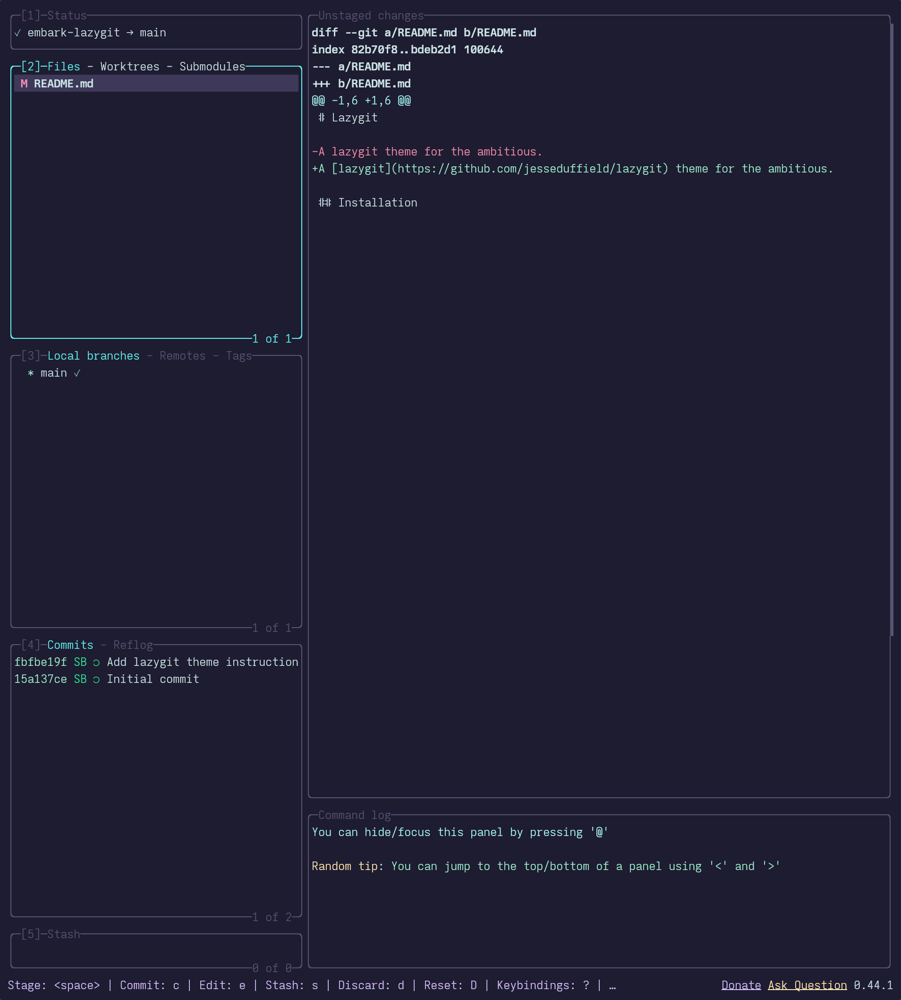

# Lazygit

A [lazygit](https://github.com/jesseduffield/lazygit) theme for the ambitious.



## Installation

### Finding your config directory
Lazygit respects XDG (for macOS and Linux), and uses AppData on Windows. So, below are the default config directories:
- Linux: `~/.config/lazygit/config.yml`
- MacOS: `~/Library/Application Support/lazygit/config.yml`
- Windows: `%APPDATA%\lazygit\config.yml`

If you cannot find the config files there, or your changes are not taking effect, you can ask lazygit itself for the config directory:
```sh
lazygit --print-config-dir
```
Keep this directory in mind for all future steps, replacing `<config-dir>` when relevant.

### Apply the theme
Edit the `gui` option of `<config-dir>/config.yaml` with the embark palette shown below.
```yaml
gui:
 theme:
   activeBorderColor:
     - '#63F2F1'
   inactiveBorderColor:
     - '#585273'
   optionsTextColor:
     - '#D4BFFF'
   selectedLineBgColor:
     - '#3E3859'
   selectedRangeBgColor:
     - '#2D2B40'
   cherryPickedCommitBgColor:
     - '#585273'
   cherryPickedCommitFgColor:
     - '#91DDFF'
   unstagedChangesColor:
     - '#F48FB1'
   defaultFgColor:
     - '#CBE3E7'
   searchingActiveBorderColor:
     - '#FFE6B3'
```
4. Close and re-open lazygit to see your new theme!

## FAQ

- Q: **_"Why is the background wrong?"_**\
  A: Lazygit uses your terminal background. See [embark theme](https://embark-theme.github.io/) for terminal ports.

## Thanks to

- [Catppuccin lazygit theme](https://github.com/catppuccin/lazygit) for README.md structure.
